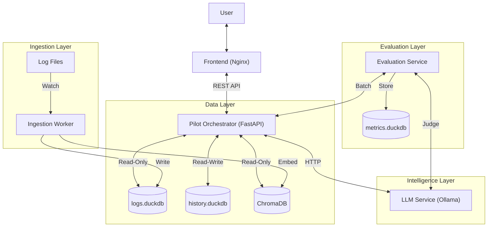
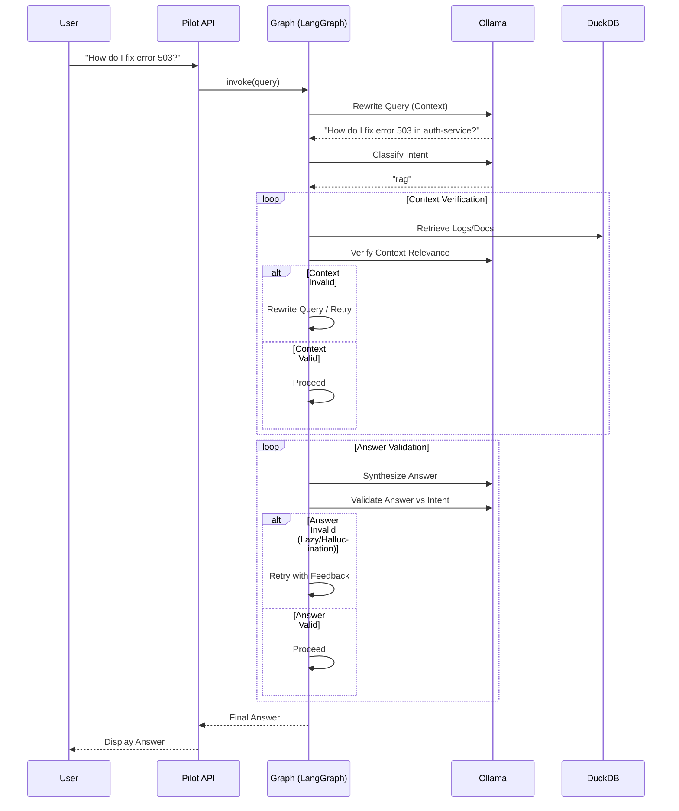
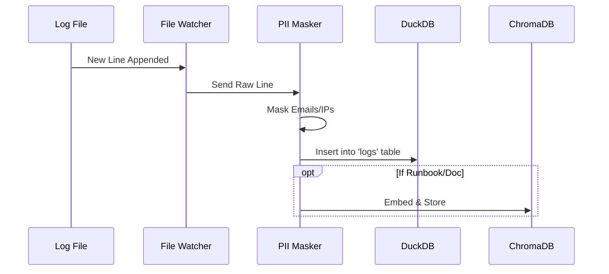

# Detailed Architecture 🏗️

## 1. Component Diagram

The LogPilot system consists of 6 main containerized services:



## 2. Sequence Diagrams

### A. User Query Flow (Agentic RAG)



### B. Ingestion Flow



## 3. Service Details

### Pilot Orchestrator
-   **Framework**: FastAPI + LangGraph.
-   **Role**: Manages the cognitive architecture (Rewrite -> Plan -> Execute -> Verify).
-   **State Management**: Uses `langgraph` StateGraph to pass context between nodes.
-   **Agentic Features**: Self-correction loops for Context and Answer verification.

### Ingestion Worker
-   **Role**: Real-time log processing.
-   **Mechanism**: Uses `watchdog` to monitor file system events.
-   **PII Masking**: Regex-based masking for emails, IP addresses, and SSNs before storage.

### Evaluation Service (New)
-   **Role**: Offline performance measurement.
-   **Stack**: FastAPI + Ragas.
-   **Function**: Runs the `golden_dataset.json` against the Pilot and scores results using an LLM Judge.

### Database Layer
-   **DuckDB**: Chosen for high-performance OLAP queries on local files.
-   **ChromaDB**: Vector store for RAG (Retrieval Augmented Generation).

## 4. Agentic RAG Deep Dive 🧠

LogPilot employs an **Agentic RAG** architecture, moving beyond simple linear chains to a cyclic, self-correcting graph.

### The "Router-Solver" Pattern
The system first classifies the user's intent to select the best tool:
1.  **SQL Solver**: For quantitative questions ("How many...", "Trend of...").
2.  **RAG Solver**: For qualitative questions ("How to fix...", "What is...").

### Self-Correction Loops
Unlike standard RAG, LogPilot verifies its own work before responding:

#### Loop 1: Context Verification (`verify_context`)
*   **Problem**: RAG often retrieves irrelevant chunks (e.g., old logs, wrong service).
*   **Solution**: An LLM node checks if the retrieved chunks actually answer the query.
*   **Action**: If irrelevant, the agent **Rewrites the Query** and retries retrieval.

#### Loop 2: Answer Validation (`validate_answer`)
*   **Problem**: LLMs can hallucinate or be lazy ("I don't know" when context is present).
*   **Solution**: An LLM node compares the generated answer against the original intent and context.
*   **Action**: If the answer is lazy or hallucinated, the agent **Regenerates** with specific feedback (e.g., "You have the logs in context, please list them.").

### State Management
We use `LangGraph` to manage the state:
```python
class AgentState(TypedDict):
    query: str
    rewritten_query: str
    rag_context: str
    context_valid: bool  # Feedback flag
    final_answer: str
    answer_valid: bool   # Feedback flag
```
This state is passed between nodes, allowing the agent to "remember" previous failures in the same turn.

## 4. Storage Optimization Strategy

The current architecture prioritizes **simplicity and context** for the LLM by storing full log bodies. However, for high-volume production environments, a **Log Normalization** strategy is designed and feasible.

### Option A: Full Log Storage (Current)
-   **Schema**: `timestamp`, `service`, `severity`, `body` (full text), `template_id`.
-   **Pros**: Zero reconstruction cost, easy debugging, full-text search.
-   **Cons**: Higher storage footprint (redundant text).
-   **Best For**: AI Agents (needs exact context), <1TB scale.

### Option B: Normalized Storage (Future Optimization)
-   **Schema**: `timestamp`, `service`, `severity`, `template_id`, `parameters` (JSON list).
-   **Mechanism**:
    1.  `LogTemplateMiner` extracts template (e.g., "User <*> failed") and parameters (e.g., `["bob"]`).
    2.  Store only the parameters in DuckDB.
    3.  Reconstruct log message dynamically for display or LLM context.
-   **Pros**: Minimal storage (up to 90% reduction for repetitive logs), efficient analytics on parameters.
-   **Cons**: Reconstruction overhead, complexity in search (cannot grep raw text).
-   **Feasibility**: Verified via `tests/check_drain3.py` that `drain3` supports parameter extraction.

## 5. Vector DB Usage Scenarios

The Vector DB (ChromaDB) is the "Semantic Brain" of LogPilot. It is used when the user's question is **vague, qualitative, or pattern-based**.

### Example 1: Semantic Discovery ("What's wrong?")
*   **User Query**: *"Are there any authentication issues?"*
*   **Why Vector DB?**: The word "issues" is subjective. SQL can't query `WHERE body LIKE '%issue%'` effectively.
*   **The Flow**:
    1.  **Embed**: Convert query to vector.
    2.  **Search**: Find patterns near "authentication" and "error/fail".
    3.  **Match**: ChromaDB returns pattern `User <*> failed to login`.
    4.  **Retrieve**: System uses the pattern's `template_id` to fetch recent logs from DuckDB.
    5.  **Answer**: "Yes, I found a recurring pattern of login failures..."

### Example 2: Pattern Matching ("Find logs like this")
*   **User Query**: *"Show me logs similar to the database timeout."*
*   **Why Vector DB?**: "Similar to" is a vector operation.
*   **The Flow**:
    1.  **Search**: ChromaDB finds the `Database connection timed out after <*> ms` pattern.
    2.  **Retrieve**: Uses `template_id` to get specific instances.

### Example 3: When is it NOT used? (Pure SQL)
*   **User Query**: *"Count the number of errors in the last hour."*
*   **Why NOT Vector DB?**: This is a precise, quantitative question.
*   **The Flow**:
    1.  **Intent Classifier**: Detects "SQL" intent.
    2.  **Generate SQL**: `SELECT count(*) FROM logs WHERE severity='ERROR' AND timestamp > now() - INTERVAL 1 HOUR`.
    3.  **Execute**: Runs directly on DuckDB. Vector DB is bypassed completely.

## 6. Production Data Architecture: Stateless on S3

In our current **Demo/MVP** environment, we ingest logs into a local DuckDB file (`logs.duckdb`). In a **Real-World Production** environment, we recommend a **Stateless Architecture** that queries data directly where it lives (e.g., S3), avoiding data duplication.

### A. Current Approach (Local Storage)
*   **Mechanism**: Ingestion Worker reads logs -> Inserts into local `logs.duckdb` file.
*   **Pros**: Extremely fast for small/medium datasets, simple setup, no network latency.
*   **Cons**: Data duplication (logs exist in file & DB), limited by local disk, stateful (harder to scale horizontally).

### B. Production Approach (Stateless on S3)
*   **Concept**: Treat S3 as the database. DuckDB acts as a **stateless compute engine** that queries Parquet files directly on S3.
*   **Mechanism**:
    1.  **Log Storage**: Logs are shipped to S3 in Parquet format (e.g., via Kinesis Firehose or FluentBit).
    2.  **Compute**: LogPilot spins up a DuckDB instance (in Lambda or Container) only when a query is needed.
    3.  **Query**: `SELECT * FROM 's3://my-log-bucket/date=2024-01-01/*.parquet'`.
*   **Pros**:
    *   **Zero Data Movement**: No need to "ingest" or move data into a separate DB.
    *   **Infinite Scale**: S3 handles the storage; DuckDB handles the compute.
    *   **Cost Effective**: Pay only for S3 storage and query compute time.

### How to Achieve This
To transition LogPilot to this architecture:

1.  **Install Extensions**:
    ```sql
    INSTALL httpfs;
    LOAD httpfs;
    INSTALL aws;
    LOAD aws;
    ```

2.  **Configure Credentials**:
    ```python
    con.execute("CALL load_aws_credentials()")
    ```

3.  **Query Directly**:
    ```python
    # Instead of querying a local table 'logs'
    sql = "SELECT count(*) FROM read_parquet('s3://company-logs/service-a/*.parquet')"
    con.execute(sql)
    ```

This allows LogPilot to become a **Zero-ETL** agent, providing intelligence on top of your existing Data Lake.

## 7. Cloud-Native Adaptation: AWS CloudWatch ☁️

For environments where logs are stored in **AWS CloudWatch Logs** (e.g., AWS Glue jobs), we can adapt LogPilot to query them directly without ingestion, acting as a smart UI over the CloudWatch API.

### Architecture Changes
To support the "Live CloudWatch Log Access" pattern, we swap specific components while keeping the core cognitive architecture:

| Component | Current (DuckDB) | Cloud-Native (CloudWatch) |
| :--- | :--- | :--- |
| **Intent Router** | `classify_intent` (Same) | `classify_intent` (Same) |
| **Generator** | `SQLGenerator` (DuckDB SQL) | **`InsightsGenerator`** (CloudWatch Syntax) |
| **Executor** | `DuckDBConnector` | **`CloudWatchConnector`** (Boto3) |
| **Vector DB** | Ingests all patterns | **Pattern Sampler** (Ingests patterns from samples) |

### Implementation Strategy

#### 1. Insights Generator (The "Translator")
We create a new prompt in `PromptFactory` to translate natural language into CloudWatch Insights syntax.

**Prompt Template**:
```text
You are an AWS CloudWatch Expert.
Translate the user question: "{query}"
Into CloudWatch Logs Insights syntax.

Example:
Q: "Show me the last 20 errors"
A: fields @timestamp, @message | filter @message like /ERROR/ | sort @timestamp desc | limit 20
```

#### 2. CloudWatch Connector (The "Executor")
#### 2. CloudWatch Connector (The "Executor")
We implement a connector using the **AWS SDK (Boto3)** to execute the generated query. This connector is responsible for:
1.  **Initiating Queries**: Sending the `start_query` request to the CloudWatch Logs API.
2.  **Polling**: Waiting for the asynchronous query execution to complete.
3.  **Result Parsing**: Converting the JSON response from CloudWatch into a structured format for the LLM.

#### 3. Smart RAG Fallback
If the user asks a qualitative question ("Why did the job fail?"), we use a **Hybrid Flow**:
1.  **Retrieve**: Fetch recent error logs via CloudWatch Insights (`filter @message like /ERROR/`).
2.  **Pattern**: Run `LogTemplateMiner` on the *retrieved results* in-memory.
3.  **Augment**: Feed the unique patterns + sample errors into the LLM to synthesize an answer.

This approach achieves **Zero Data Duplication** while leveraging LogPilot's agentic capabilities.

## 8. Design Considerations & Trade-offs ⚖️

This section summarizes the key architectural decisions to help stakeholders understand "Why" we built it this way.

### A. Why DuckDB + ChromaDB? (The Hybrid Engine)
*   **The Problem**: Vector DBs are great for "vague" questions but terrible for "precise math" (e.g., "Count errors"). SQL DBs are the opposite.
*   **The Solution**: We use **Both**.
    *   **DuckDB**: Handles the "Hard Math" (Counting, Aggregation, Filtering).
    *   **ChromaDB**: Handles the "Soft Logic" (Pattern matching, Similarity).
*   **Business Value**: You get the accuracy of a SQL report with the flexibility of ChatGPT.

### B. Why "1 Vector Per Pattern"?
*   **The Problem**: Storing every single log line as a vector is expensive and slow (100M logs = 100M vectors).
*   **The Solution**: We only store **Unique Patterns** (e.g., 1 vector for "User <*> failed").
*   **Business Value**:
    *   **99% Cost Reduction**: A system with 100M logs might only have 500 unique patterns.
    *   **Faster Answers**: Searching 500 vectors is instant.

### C. Why "Zero-ETL" for Production? (S3/CloudWatch)
*   **The Problem**: Moving data from S3/CloudWatch to another DB costs money (egress) and time (latency).
*   **The Solution**: Bring the compute to the data.
    *   **Stateless DuckDB**: Queries S3 Parquet files directly.
    *   **CloudWatch Connector**: Queries AWS Logs directly.
*   **Business Value**:
    *   **Real-Time**: No waiting for ingestion pipelines.
    *   **Cost Savings**: No duplicate storage costs.
    *   **Simplicity**: Fewer moving parts to maintain.
