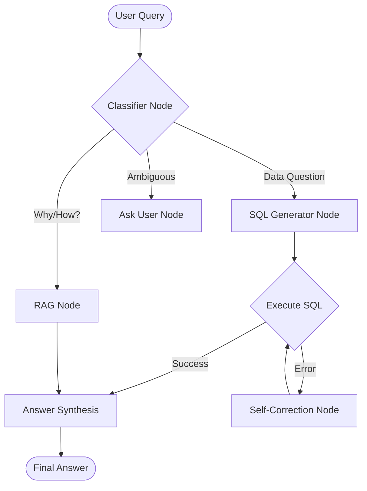

# Agent Framework & LLM Integration Design

## 1. Framework Selection & Architecture
We will adopt a **Hybrid Architecture** leveraging the best tools for each domain:

| Component | Technology | Why? |
|-----------|------------|------|
| **Orchestration** | **LangGraph** | Provides stateful, cyclic workflows (Plan → Act → Observe → Loop). Better than linear chains or raw `if/else` logic for complex reasoning. |
| **Data / RAG** | **LlamaIndex** | Best-in-class for data ingestion, indexing, and retrieval. Simplifies vector store management for our Knowledge Base. |
| **Configuration** | **Hydra / YAML** | For managing model parameters and prompts. |

### Pros & Cons Analysis

#### LangGraph (for Control Plane)
*   **✅ Pros**:
    *   **State Management**: Built-in memory of the conversation and current task state.
    *   **Cyclic Graphs**: Allows the agent to "retry" a failed SQL query or ask clarifying questions (Loops).
    *   **Observability**: Easier to trace *why* an agent took a specific path.
*   **❌ Cons**:
    *   Learning curve (Graph nodes/edges vs. simple functions).

#### LlamaIndex (for Data Plane)
*   **✅ Pros**:
    *   **Data Connectors**: Out-of-the-box support for many data sources.
    *   **Advanced Retrieval**: Recursive retrieval, re-ranking, and metadata filtering are built-in.
*   **❌ Cons**:
    *   Overkill for simple text generation (which is why we use LangGraph for flow).

---

## 2. Detailed Design with LangGraph

### The "Pilot Graph" (State Machine)

Instead of a simple router, the Pilot Orchestrator will be a **StateGraph**:



### Node Definitions

1.  **Classifier Node**:
    *   Input: User Query history.
    *   LLM Call: Decides intent (`sql`, `rag`, `chat`).
    *   Output: Updates `state.intent`.

2.  **SQL Generator Node**:
    *   Input: Query + Schema Context.
    *   LLM Call: Generates DuckDB SQL.
    *   Output: Updates `state.sql_query`.

3.  **Self-Correction Node** (The Power of LangGraph):
    *   Triggered if `Execute SQL` fails.
    *   Input: Failed SQL + Error Message.
    *   LLM Call: "Fix this SQL error."
    *   Output: New SQL.

---

## 3. Configuration Management (`config/llm_config.yaml`)

```yaml
llm:
  providers:
    openai:
      api_key_env: "OPENAI_API_KEY"
      model_fast: "gpt-4o-mini"
      model_smart: "gpt-4o"
    gemini:
      api_key_env: "GEMINI_API_KEY"
      model_fast: "gemini-1.5-flash"
      model_smart: "gemini-1.5-pro"

agents:
  pilot_graph:
    recursion_limit: 5 # Max retries for self-correction
    provider: "openai"
```

## 4. Prompt Management (`prompts/`)
We will still use Jinja2 templates, but they will be loaded into LangChain `PromptTemplates`.

*   `prompts/pilot/classifier.j2`
*   `prompts/pilot/sql_gen.j2`
*   `prompts/pilot/sql_fix.j2` (New!)

### Step 3: Build Nodes
Implement each node as a function that takes `AgentState` and returns an update.

### Step 4: Compile Graph
Connect nodes with edges and conditional logic.

```python
workflow = StateGraph(AgentState)
workflow.add_node("classify", classify_node)
workflow.add_node("sql_gen", sql_gen_node)
# ...
workflow.set_entry_point("classify")
app = workflow.compile()
```
