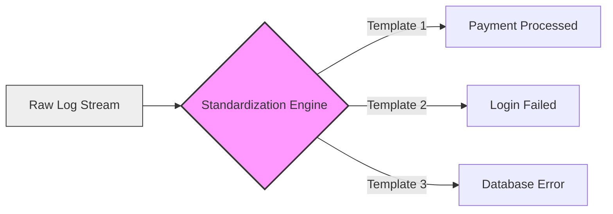
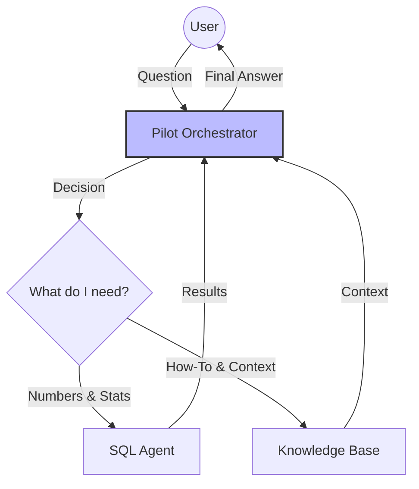
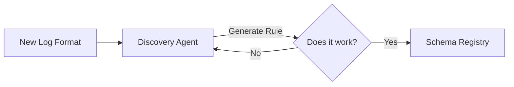

# 🚀 LogPilot: Business Architecture Overview

This document provides a high-level, non-technical explanation of how LogPilot works. It breaks down the complex AI architecture into simple "Design Points" to help stakeholders understand the value and logic behind the system.

---

## 1. The Core Problem: "Data Noise"
Modern applications generate millions of log lines every day. Most of this is repetitive noise (e.g., "Payment processed for user X", "Payment processed for user Y").
*   **The Challenge**: Finding the "needle in the haystack" (errors, anomalies) is impossible for humans and expensive for traditional AI.
*   **The Solution**: We need to clean and compress this data *before* it reaches the AI.

---

## 2. Design Point: The Standardization Engine (Drain3)
**"Converting Noise into Signals"**

Before the AI ever sees a log, it passes through our **Standardization Engine**. This component (technically called "Drain3") automatically learns the "templates" of your logs.

### Why is this important?
It converts unstructured text into structured events. Instead of storing 1 million strings, we store 1 template ("Payment processed for user <ID>") and a count (1 million). This reduces storage costs and makes the AI's job 100x easier.



---

## 3. Design Point: The "Brain" (Pilot Orchestrator)
**"Thinking Before Acting"**

Most chatbots just guess. LogPilot has a dedicated "Brain" (Orchestrator) that follows a strict workflow to ensure accuracy. It doesn't just answer; it **plans**.

### How it works:
1.  **Understand**: "What is the user asking?" (Data question vs. Knowledge question)
2.  **Plan**: "I need to query the database for error counts."
3.  **Act**: Executes the SQL query.
4.  **Verify**: "Does this answer make sense?"



---

## 4. Design Point: The Knowledge Base
**"Long-Term Memory"**

The **Knowledge Base** is where LogPilot stores everything that isn't a number. This includes:
*   **Log Samples**: "What does a 'Connection Timeout' actually look like?"
*   **Documentation**: "How do I fix error code 503?"
*   **Runbooks**: "If the database is slow, check these metrics."

When the "Brain" needs context, it searches this library instantly.

---

## 5. Design Point: Schema Discovery
**"Learning New Languages"**

New services are added all the time, often with new log formats. Instead of asking engineers to write parsing rules manually, LogPilot uses a specialized AI agent to **learn** the new format automatically.

1.  **Observe**: Look at the new logs.
2.  **Hypothesize**: "I think this is the timestamp, and this is the error code."
3.  **Test**: Verify the hypothesis against real data.
4.  **Deploy**: Save the rule for the Standardization Engine.


    Validator -->|No| Discovery
```

---

## 6. Design Point: Business Context (System Catalog)
**"Knowing Who Owns What"**

Logs tell us *what* broke. The System Catalog tells us *who* cares.
By combining logs with a "Phone Book" of the company (System Catalog), LogPilot can answer questions like:
*   "Which **Department** is having the worst week?"
*   "Alert the **Owner** of the Payment Service."

This turns technical noise into business intelligence.
