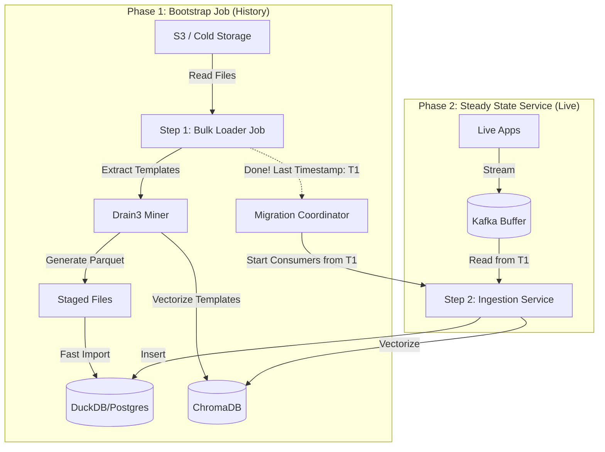

GenAI LogPilot: Microservices Architecture & Process Flow

1. Process Flow Diagram (Sequential Phases)

We divide the lifecycle into two distinct phases: Bootstrap (History) and Steady State (Real-Time). They do not run simultaneously.

2. Microservices Breakdown

A. The Data Plane (Ingestion)

Service Name

Type

Responsibility

1. LogPilot Bulk Loader

A- **Name**: `bulk-loader`
- **Type**: Batch Job (Python Script: `log_loader.py`)
- **Responsibility**:
    - Read historical log files from `data/landing_zone/`.
    - Perform initial Template Mining (Drain3).
    - Populate the `logs` table in DuckDB.
- **Key Dependencies**: `duckdb`, `drain3`.
- **Scaling**: Can be parallelized by partitioning files (e.g., one job per year), but for MVP it's a single process.

2. LogPilot Collector

Daemon

Lightweight agent (Fluentd/Vector) on the edge. Buffers live logs to Kafka during Phase 1.

3. Ingestion Worker

Service

The always-on worker. It stays paused during Phase 1. Once Phase 1 finishes, it wakes up and drains the Kafka buffer.

4. Schema Registry

Service

Shared by both phases. Stores the regex rules

### 4. **Pilot Orchestrator (Service)**
*   **Path**: `services/pilot_orchestrator/`
*   **Tech**: LangGraph, LangChain
*   **Role**: The central brain. Receives queries, classifies intent, generates SQL, or retrieves from Knowledge Base.
*   **Key Components**:
    *   `graph.py`: Defines the cyclic state machine.
    *   `nodes.py`: Implements the logic for each step (Classifier, SQL, RAG).

### 5. **Knowledge Base (Service)**
*   **Path**: `services/knowledge_base/`
*   **Tech**: LlamaIndex, ChromaDB
*   **Role**: Stores and retrieves unstructured log data and documentation.
*   **Key Components**:
    *   `store.py`: Manages the vector index.
    *   `converter.py`: Transforms raw logs into semantic documents.

### 6. **Schema Discovery (Service)**
*   **Path**: `services/schema_discovery/`
*   **Tech**: LLM, Regex
*   **Role**: Automatically learns how to parse new log formats.
*   **Key Components**:
    *   `generator.py`: LLM-based regex generation.
    *   `validator.py`: Strict regex validation against samples.

### 7. **Evaluator (Service)**
*   **Path**: `services/evaluator/`
*   **Tech**: Pandas, Scikit-Learn
*   **Role**: Benchmarks agent performance.
*   **Key Components**:
    *   `runner.py`: Executes agents against golden datasets.
    *   `scorer.py`: Calculates accuracy metrics.
aph" (Classify -> Plan -> Act -> Observe).
- **Error Handling**: Implements self-correction loops for failed tool executions.

### Key Components
- **Graph Definition**: Defines nodes (Classifier, SQLGen, RAG) and edges.
- **State Schema**: TypedDict defining the agent's memory structure.

---

## 7. Tool Service & Knowledge Base
**Tech Stack**: Python, LlamaIndex, DuckDB

### 7.1 SQL Tool
- **Function**: Text-to-SQL generation.
- **Backend**: DuckDB.

### 7.2 Knowledge Base (LlamaIndex)
- **Function**: RAG (Retrieval-Augmented Generation).
- **Backend**: ChromaDB (Vector Store).
- **Features**:
    - **Ingestion Pipeline**: Loads documents/runbooks.
    - **Query Engine**: Semantic search with re-ranking.rvices

Service

The SQL Generator and RAG Retriever APIs.

8. Lifecycle Manager

Service

Background service that manages Data Tiering.
- **Task**: Runs daily to move logs > 30 days from DuckDB (Hot) to S3 Parquet (Warm), and logs > 1 year to Glacier (Cold).
- **Compliance**: Executes "Right to be Forgotten" purge requests.

3. Phased Ingestion Strategy

We execute the project in two strict sequential steps to minimize complexity and resource usage.

Phase 1: The History Backfill (The "Batch" Step)

Goal: Ingest 5 years of logs as fast as possible.

Infrastructure: High-CPU instances (Spot Instances) that are terminated after the job.

Method:

Drain3 Mining: The job reads raw text files and clusters them into Templates.

Parquet Staging: It converts raw text into structured Parquet files (Columnar format) locally.

Bulk Load: Uses COPY FROM 'file.parquet' to load DuckDB at speeds of ~1 million rows/sec.

Result: The Database is populated up to Timestamp_T1 (e.g., Yesterday 11:59 PM).

Phase 2: The Live Cutover (The "Stream" Step)

Goal: Keep the database up to date with new logs.

The "Gap" Handling:

While Phase 1 was running (say it took 2 days), new logs were generated.

These new logs were buffered in Kafka (retention set to 7 days).

The Start Signal:

Phase 1 finishes and outputs Last_Processed_Time: T1.

The Ingestion Worker starts up.

It asks Kafka: "Give me all logs after T1."

It rapidly consumes the 2-day buffer (Catch-up Mode).

Once caught up, it enters "Real-Time Mode."

4. How to "Microservice" the Steps (Implementation Guide)

Step 1: The "Job" vs. "Service" Distinction

Docker Container A (loader-job): Contains the Python script using pandas/duckdb for local file processing. Optimized for Disk I/O.

Docker Container B (stream-worker): Contains the Python script using kafka-python. Optimized for Network I/O.

Step 2: Shared Knowledge (The Schema Registry)

Crucial: Phase 1 will discover 99% of your log templates (e.g., "Database Timeout Pattern").

The Handover: Phase 1 saves these regex rules to the Schema Registry.

Benefit: When Phase 2 starts, it doesn't need to ask the LLM "What is this log?" because Phase 1 already defined it. Phase 2 runs extremely fast because the "cache" is pre-warmed.

5. Developer Guide: Implementation Details

To help new developers understand the current implementation state and extend functionality:

5.1 Shared Utilities (`shared/`)
- **PII Masking (`shared/utils.py`)**:
    - **Class**: `PIIMasker`
    - **Capabilities**: Uses regex to detect and redact:
        - Emails (`<EMAIL_REDACTED>`)
        - IPv4 Addresses (`<IP_REDACTED>`)
        - Credit Cards (`<CC_REDACTED>`)
        - SSNs (`<SSN_REDACTED>`)
    - **Usage**: Applied automatically in the Ingestion Worker before data reaches the DB.

5.2 Ingestion Worker Internals (`services/ingestion-worker/`)
- **Mocking Strategy (Prototype Phase)**:
    - **Kafka**: `MockKafkaConsumer` generates synthetic logs (including PII scenarios) to simulate a stream without a real broker.
    - **Schema Registry**: `MockSchemaRegistry` simulates the "Drain3" template mining logic in-memory.
- **Performance Patterns**:
    - **Batch Processing**: Logs are buffered in memory (`self.batch_buffer`) and bulk-inserted into DuckDB every N records (default: 5) or on shutdown. This reduces I/O overhead.
- **Persistence**:
    - Data is stored in `data/logs.duckdb`.
    - Schema: Defined in `shared/db_connectors.py`.

5.3 System Catalog (Data Source)
- **File**: `data/system_catalog.csv`
- **Purpose**: Maps technical service names to business metadata (Department, Owner, Criticality).
- **Ingestion**:
    - **Mechanism**: `DuckDBConnector.load_catalog()` reads the CSV directly into the `system_catalog` table.
    - **Trigger**: Automatically loaded on service startup if the file exists.
    - **Schema**: `system_name` (PK), `department`, `owner_email`, `criticality`.

6. Extensibility Scenarios

Adding a New Log Type

During Phase 1: Add the file path to the Bulk Loader config.

During Phase 2: Point the Log Collector to the new file. The Schema Registry will detect it's a new pattern (unknown to Phase 1) and trigger the Schema Agent to learn it.

Scaling the History Load

If 5 years of data is too big for one machine, you can shard Phase 1:

Job A: Process Years 1-2.

Job B: Process Years 3-4.

Job C: Process Year 5.

They all write Parquet files to a shared folder, and the final DB load is a single command.