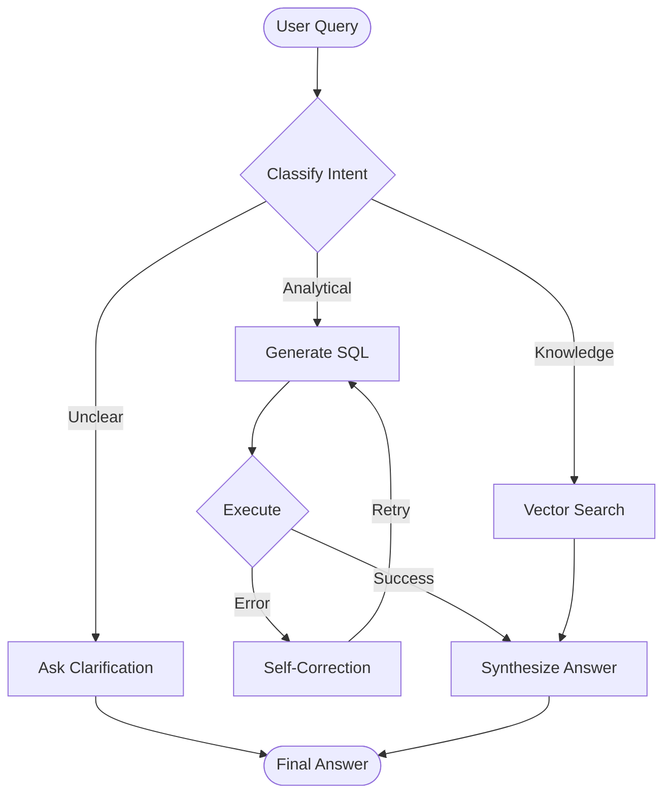

# Detailed System Workflow (V2)

## 1. High-Level Architecture Flow

```text
┌────────────────┐
│ source_systems │  ← Log Files, Kafka Streams
└──────┬─────────┘
       ▼
┌─────────────────────────┐
│ ingestion_layer         │  ← Ingestion Worker (PII Masking, Template Mining)
└──────┬──────────────────┘
       ▼
┌─────────────────────────┐
│ storage_layer           │  ← DuckDB (Structured) + ChromaDB (Vectors)
└──────┬──────────────────┘
       ▼
┌────────────────┐
│ intelligence   │  ← Pilot Orchestrator (LangGraph) + Knowledge Base (LlamaIndex)
└──────┬─────────┘
       ▼
┌─────────────────────────┐
│ api_gateway             │  ← FastAPI (REST Interface)
└──────┬──────────────────┘
       ▼
┌─────────────┐
│ user_clients│  ← CLI, Web UI, Chatbot
└─────────────┘
```

## 2. Data Zones & Usage

| Zone                 | Component                                | Purpose                                                              |
|----------------------|------------------------------------------|----------------------------------------------------------------------|
| **Landing Zone**     | `data/landing_zone`                      | Raw log files waiting for ingestion.                                 |
| **Bronze Layer**     | `Ingestion Worker`                       | In-memory processing, PII masking, and template extraction.          |
| **Silver Layer**     | `DuckDB (logs table)`                    | Structured, queryable log data with JSON context.                    |
| **Gold Layer**       | `ChromaDB (Embeddings)`                  | Semantic vectors for RAG and knowledge retrieval.                    |
| **Intelligence**     | `Pilot Orchestrator`                     | Agentic reasoning, SQL generation, and self-correction loops.        |

## 3. Component Workflows


### 2.1 Data Plane: Ingestion Pipeline
**Components**: `Ingestion Worker`, `Schema Registry`, `DuckDB`

1.  **Ingest**: Read from Kafka/File.
2.  **Mask**: Apply Regex to redact PII (Email, IP, SSN).
3.  **Mine**:
    *   Check `Schema Registry` for existing template.
    *   If new, use LLM (Schema Discovery Agent) to generate Regex.
4.  **Store**:
    *   **Structured**: Insert `LogEvent` into DuckDB.
    *   **Unstructured**: Generate embedding and insert into ChromaDB (LlamaIndex).

### 2.2 Control Plane: Pilot Orchestrator (LangGraph)
**The "Brain" uses a Cyclic Graph to handle complex queries.**


##  The Flow
1.  **Ingestion Worker**: Reads the Raw Log.
2.  **Parser**: Extracts timestamp/service (Regex).
3.  **Miner**: Extracts the Template (Drain3).
4.  **Router**:
    *   --> **DuckDB**: Inserts the structured row immediately.
    *   --> **Knowledge Base**: (Async) Embeds the log/template for semantic search.
    
#### Workflow Steps:
1.  **Classify**: LLM determines if the user wants data (`SQL`) or explanation (`RAG`).
2.  **SQL Loop**:
    *   **Generate**: Create SQL based on `LogEvent` schema.
    *   **Execute**: Run against DuckDB.
    *   **Observe**: If error (e.g., "Column not found"), loop back to **Generate** with error context.
3.  **RAG Step**:
    *   **Retrieve**: Query LlamaIndex for similar logs/docs.
    *   **Synthesize**: Combine retrieved chunks into an answer.

### 2.3 Schema Discovery (Agentic)
**Triggered when a new log pattern is detected.**

1.  **Detect**: `TemplateMiner` sees a log that doesn't match known Regex.
2.  **Analyze**: Send sample to `SchemaDiscoveryAgent` (LLM).
3.  **Generate**: LLM outputs a Regex pattern and field extraction rules.
4.  **Validate**: Test Regex against the sample.
5.  **Register**: Save to `Schema Registry`.

