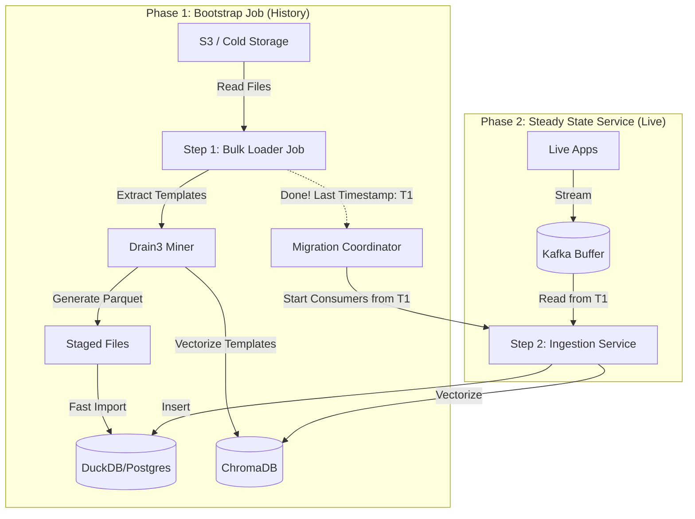

# 🛠️ LogPilot V2: Technical Reference

This document serves as the comprehensive technical guide for developers working on LogPilot. It consolidates the system architecture, component details, script catalog, and functional checklists.

---

## 1. Microservices Architecture

### 1.1 Process Flow
The system operates in two distinct phases:
1.  **Bootstrap (History)**: Batch processing of historical logs.
2.  **Steady State (Live)**: Real-time stream processing.



### 1.2 Component Breakdown

#### A. Data Plane (Ingestion)
| Service | Type | Responsibility |
|---------|------|----------------|
| **Bulk Loader** | Batch Job | Reads historical files (JSON/Syslog/Standard), mines templates, loads DuckDB. |
| **Ingestion Worker** | Service | Consumes Kafka stream, masks PII, inserts into DB/Vector Store. |
| **Schema Registry** | Service | Stores regex rules discovered by the Agent. |
 
 ### 1.4 LLM Configuration
 The system uses a centralized configuration file `config/llm_config.yaml` to manage LLM providers.
 
 #### Structure
 ```yaml
 llm:
   default_provider: "openai" # or "local"
   providers:
     openai:
       api_key_env: "OPENAI_API_KEY"
       models:
         fast: "gpt-4o-mini"
         reasoning: "gpt-4o"
     local:
       api_base: "http://localhost:11434/v1"
       default_model: "llama3"
 ```
 *   **`default_provider`**: Controls which provider is active system-wide.
 *   **`providers`**: Defines connection details for each provider.
 *   **`models`**: Maps abstract roles (`fast`, `reasoning`) to concrete model names.
 
 ### 1.5 Model Selection Guide
 Choose the right model based on your available hardware and performance needs.
 
 | Category | Model | Params | Min RAM | Best For | Notes |
 | :--- | :--- | :--- | :--- | :--- | :--- |
 | **Consumer** | `llama3` | 8B | 8GB | **General Purpose** | Recommended default for M-series Macs. |
 | **Consumer** | `mistral` | 7B | 8GB | Reasoning | Strong logic, efficient. |
 | **Consumer** | `phi3` | 3.8B | 4GB | Speed / Simple Tasks | Ultra-lightweight. |
 | **Server** | `llama3:70b` | 70B | 48GB | **Complex Reasoning** | GPT-4 class. Requires heavy hardware. |
 | **Server** | `mixtral:8x7b` | 47B | 26GB | Context / RAG | Mixture-of-Experts. Good efficiency. |
 | **Server** | `qwen2.5:72b` | 72B | 48GB | Coding / Math | Top-tier for technical tasks. |
 
 ### 1.6 Deep Dive: Log Parsing Logic (`LogParser`)
The `LogParser` acts as a **Normalization Layer**, converting raw strings into a structured dictionary.

**1. Strategy Pattern (The "Waterfall")**
It attempts to parse a log line using the following order:
1.  **JSON**: Checks if line starts with `{`. If valid JSON, extracts fields.
2.  **Regex Patterns**: Tries known formats (Standard, Syslog, Nginx).
3.  **Fallback**: If no match, treats the entire line as `body` with `severity=UNKNOWN`.

**2. Metadata Extraction**
Regardless of the input format, the parser normalizes data into these **Golden Fields**:
*   **`timestamp`**: Converted to **UTC** datetime.
*   **`severity`**: `INFO`, `ERROR`, `WARN` (Inferred if missing).
*   **`service_name`**: Extracted from log content (e.g., `auth-service`, `nginx`).
*   **`body`**: The core message used for **Template Mining**.
*   **`context`**: A dictionary containing all other dynamic fields (e.g., `ip`, `status`, `latency`).

#### B. Control Plane (Intelligence)
| Service | Tech | Responsibility |
|---------|------|----------------|
| **Pilot Orchestrator** | LangGraph + Jinja2 | Central brain. Routes queries, generates SQL via LLM, retrieves knowledge. Uses a **State Machine** for robust flow control. |
| **Knowledge Base** | LlamaIndex | Manages ChromaDB for semantic search (RAG) with Metadata Filtering. |
| **Schema Discovery** | LLM | Learns new log formats and generates regex rules. |
| **Evaluator** | Scikit-Learn | Benchmarks agent performance against golden datasets. |
| **API Gateway** | FastAPI | REST interface (`POST /query`) for external clients. |

---

## 2. Script Catalog & Directory Structure

### 📂 Services
| Path | Key Script | Function |
|------|------------|----------|
| `services/pilot-orchestrator/` | `src/graph.py` | Defines the LangGraph state machine. |
| `services/knowledge_base/` | `src/store.py` | Manages ChromaDB vector index. |
| `services/api_gateway/` | `src/main.py` | FastAPI entry point. |
| `services/schema_discovery/` | `src/generator.py` | LLM-based regex generation. |
| `services/evaluator/` | `src/runner.py` | Runs evaluation benchmarks. |
| `services/ingestion-worker/` | `src/main.py` | Real-time ingestion loop. |
| `services/bulk-loader/` | `src/log_loader.py` | Bulk loader with multi-format support (`--landing_zone`). |

### 📦 Shared Libraries (`shared/`)
| File | Class | Purpose |
|------|-------|---------|
| `llm/client.py` | `LLMClient` | Unified interface for OpenAI/Gemini/Local LLMs. |
| `db/duckdb_client.py` | `DuckDBConnector` | Handles DuckDB connections and batch loading. |
| `utils/pii_masker.py` | `PIIMasker` | Redacts Email, IP, SSN using regex. |
| `utils/log_parser.py` | `LogParser` | Robust parser for Standard, JSON, Syslog, Nginx. |
| `log_schema.py` | `LogEvent` | Pydantic model for the Golden Standard Schema. |

### 📂 Data Directory Structure
| Path | Purpose |
|------|---------|
| `data/source/` | **Input**: Raw logs (`landing_zone`), reference data (`system_catalog.csv`). |
| `data/target/` | **Output**: Structured DB (`logs.duckdb`), Vector Store (`vector_store`). |
| `data/state/` | **Internal**: Persistence files (`drain3_state.bin`). |
| `prompts/` | **Templates**: Jinja2 templates for LLM prompts (`sql_generator.j2`, `synthesize_answer.j2`). |

### 📜 Utility Scripts (`scripts/`)
| Script | Usage | Description |
|--------|-------|-------------|
| `reset_demo.py` | `python3 scripts/reset_demo.py --count N` | **Reset**: Cleans `data/target` & `data/state`, generates fresh logs in `data/source`. |
| `generate_logs.py` | `python3 scripts/generate_logs.py --format json` | **Generate**: Creates mock logs in various formats. |
| `compare_models.py` | `python3 scripts/compare_models.py` | **Benchmark**: Compares Local vs. Cloud LLM performance. |
| `e2e_test.sh` | `./scripts/e2e_test.sh` | **Test**: Runs full end-to-end validation. |

---

## 3. Functional Review Checklist

### 📥 Ingestion Layer
- [x] **PII Masking**: Redacts Emails, IPs, Credit Cards.
- [x] **Template Mining**: Extracts constant templates via Drain3.
- [x] **Log Parsing**: Structured extraction of Timestamp, Severity, Service.
    - [x] **Multi-Format Support**: Standard, JSON, Syslog, Nginx.

### 🧠 Knowledge Base
- [x] **Ingestion**: Converts Logs -> LlamaIndex Documents.
- [x] **Retrieval**: Semantic search via ChromaDB.
- [x] **Optimization**: Embeds raw log context for "Why" questions.

### 🚁 Pilot Orchestrator
- [x] **Intent Classification**: Routes to SQL (Data) or RAG (Knowledge).
- [x] **SQL Generation**: LLM-based Text-to-SQL for DuckDB using Jinja2 templates.
- [x] **RAG Synthesis**: Combines retrieved context into natural answers.

### 📊 Evaluator
- [x] **Metrics**: Measures Regex Match, SQL Accuracy, RAG Relevance.
- [x] **Datasets**: Golden datasets for benchmarking.

### 📚 System Catalog & Advanced
- [x] **Unified Data Layer**: Maps Services -> Departments (Many-to-Many).
- [x] **Local LLM**: Supports `provider="local"` (M4 Chip).
 
 ## 4. Deployment (Docker)
 The system is fully containerized for easy deployment.
 
 ### 4.1 Quick Start
 ```bash
 # Start all services (LLM, Ingestion, Pilot)
 docker-compose up --build
 ```
 *   **`llm-service`**: Starts Ollama and pulls `llama3` automatically.
 *   **`ingestion-worker`**: Begins processing logs from `data/source`.
 *   **`pilot-orchestrator`**: Starts the agent API.
 
 ### 4.2 Configuration
 To use the internal Docker LLM, update `config/llm_config.yaml`:
 ```yaml
 llm:
   default_provider: "local"
   providers:
     local:
       api_base: "http://llm-service:11434/v1" # Docker service name
 ```
 
 ## 5. Testing Strategy
 The system uses a comprehensive testing pyramid.
 
 ### 5.1 Unit & Integration Tests
 *   **Shared Libs**: `shared/tests/` (LLM Client, DB Connector).
 *   **Knowledge Base**: `services/knowledge_base/tests/` (Store, Filtering).
 *   **Pilot Orchestrator**: `services/pilot_orchestrator/tests/` (Nodes, Prompts, API).
 
 ### 5.2 End-to-End (E2E) Tests
 *   **Location**: `tests/e2e/test_full_flow.py`
 *   **Scope**: Simulates a full user query via the API (`POST /query`).
 *   **Method**: Mocks the LLM and DB to ensure deterministic verification of the orchestration logic.
 
 ### 5.3 Benchmarking
 *   **Script**: `scripts/compare_models.py`
 *   **Purpose**: Compares accuracy of different LLM models (Cloud vs. Local) on standard tasks like schema discovery.
